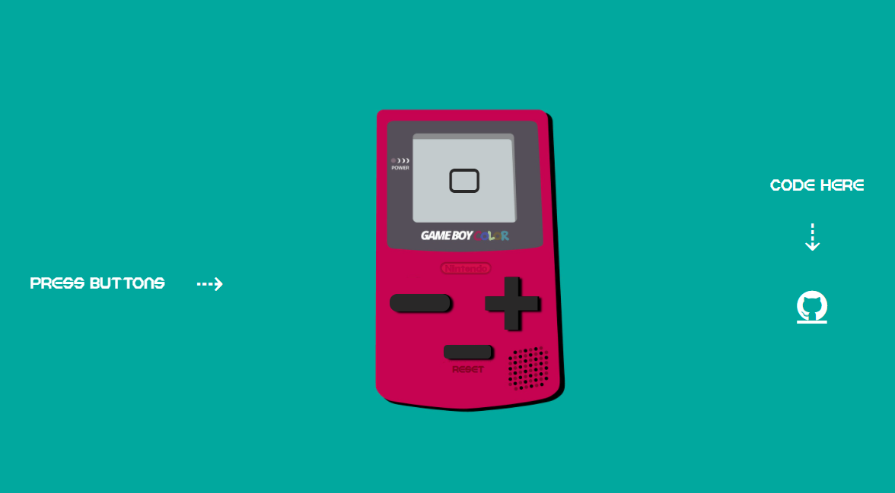

# JavaScript basics project - building a counter app

## Table of contents

- [About The Project](#about-the-project)
  - [Links](#links)
  - [Description](#description)
  - [Built with](#built-with)
  - [Useful resources](#useful-resources)
- [Author](#author)

## About The Project

### Links

- Live Site ➟ [Counter App](https://incrementing-decrementing.netlify.app/)

### Description

Project goals given by Start2Impact:

- The first counter value should be 0
- The user should be able to increment and decrement the number by clicking two buttons
- The rendering of the +/- buttons and of the updated number must be implemented with pure JavaScript

Additional functionalities:
- Added a reset button
- Increase and decrease by keeping the buttons pressed

Extra animation using javascript and css:
- Pulsation of the first numbers before and after zero
- The last number of the counter turns red, to indicate the end
- Button depth effect
- Alternaly change the arrow scale
- When any button is pressed the movement of the arrow stops

### Built with

- HTML5 
- CSS
- Sass
- JavaScript

### Useful resources

- [javascript.info](https://javascript.info/)
- [W3School](https://www.w3schools.com/)
- [MDN Web Docs](https://developer.mozilla.org/en-US/)

## Author
- LinkedIn ➟ [Marco Verardi](https://www.linkedin.com/in/marco-verardi-664555150/)
